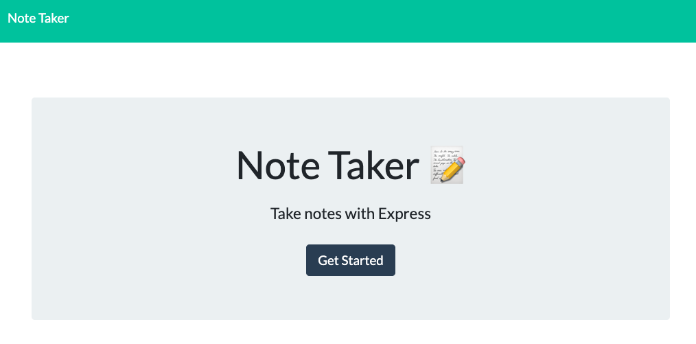

  # Notes at-a-glance

  

  ## Description
  
  This application allow to make a quick notes, view notes, delete if they are not more actual.

  

  ## Table of Contents
 
  - [Installation](#installation)
  - [Usage](#usage)
  - [Credits](#credits)
  - [License](#license)
  - [Questions](#questions)
  - [Contribution guidelines](#contribution%20guidelines)
  - [Tests](#tests)
    
  ## Installation
  
  To run application locally: 
  
  1. Download the code. 
  
  2. Run from the root: ``node server.js``
  
  ## Usage
  
  

  Click on 'Get Started' button to navigate to the notes page: 
  - existing notes listed in the left-hand column
  - empty fields to enter a new note title and the note’s text in the right-hand column
  - to see saved notes, click on an existing note in the list in the left-hand column. Selected note appears in the right-hand column.
  
  Add new note:
  - enter a new note title and the note’s text
  - click on the Save icon
  - the new note that was entered is saved and appears in the left-hand column with the other existing notes

  
  
  ## Credits
  
  - Olga Gavrushenko
  - UC Berkley Extension Learning materials
  
  ## License
  
  

  This application is available under the license: MIT License. 
    See the LICENSE file for more info. Full details available by link https://choosealicense.com/licenses/mit/. 
    
 
  ## Questions
  
  Link to my GitHub profile https://github.com/olgagav/
  
  If you have additional questions or proposals please email me: [ogavby@gmail.com](mailto:ogavby@gmail.com?subject=[GitHub]%20command-line%20password%20generator)
    
  ## Contribution guidelines

  Contributions are what make the open source community such an amazing place to learn, inspire, and create. Any contributions you make are greatly appreciated.  Fork the Project   - Create your Feature Branch   - Commit your Changes   - Push to the Branch   - Open a Pull Request
  
  ## Tests
  
  n/a
  
